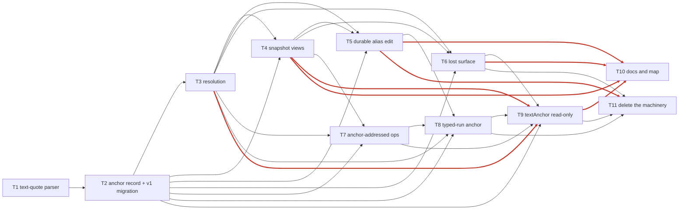

# Durable anchors — implementation tickets

Source spec: `docs/specs/durable-anchors.md` (approved).
Branch: `feat/comments-rebuild`, worktree `/home/sil/wiki-viewer/.worktrees/comments-rebuild`.

Eleven tracer-bullet tickets. Each one is a vertical slice: it changes a stored shape
*and* the code that reads it, so the app works at the end of the ticket. No ticket is a
layer ("add the schema", then "add the API").

## Facts the tickets are built on (verified by reading the code, not assumed)

These change what the tickets have to do, so they are stated up front.

1. **`locateCommentAnchor` already scores candidates by prefix/suffix proximity.**
   `src/lib/proof/comment-decorator.ts:86-95` takes `preferNear` and picks the hit with the
   smallest `|hit - target|`. Today the only caller passes no `preferNear`
   (`comment-decorator.ts:136`), so it falls back to `anchor.start`. Therefore the
   `ambiguous` status is not a new algorithm — it is a new *diagnosis* of that existing
   search, plus giving the caller the candidates it already computed.
2. **Resolution has to be produced in a second place, not only a new module.** The editor
   renders highlights from `snapshotBlocks` + `byPath[path].sidecar`
   (`editor.tsx:396-436`, `comment-highlight.ts:108`). Those two values arrive from two
   independent HTTP calls (`proof-store.ts:41` `loadSidecar`, `proof-store.ts:71`
   `loadSnapshot`). A pure `resolveAnchor(sidecar, anchor, currentBlocks)` cannot be called
   in the editor without a `Sidecar` object that the browser may not hold. So the *server*
   must resolve anchors against the current blocks and hand the result to the client. This
   is the same coordinate-separation bug that produced the "list item painted `Reactions `"
   failure documented in `docs/ux-contracts.md`.
3. **Two of the spec's eight cases are already pinned by tests that will break.**
   `.review/perturb-f1f4.sh` guard `f8-edited-block-alias` disables the positional alias
   pass and asserts `comment-highlight.test.ts` fails; guard `f6-block-comment-highlight`
   disables the block-granular fallback in the same file. Guards `f8` and `f6` are therefore
   deleted *by* the tickets that remove the mechanisms they protect (T3, T9), and their
   cases are re-pinned as direct anchor tests.
4. **`docs/ux-contracts.md` §5.3 currently forbids what this spec requires.**
   §5.3 says an annotation whose anchor is gone is *cancelled* and "no re-anchor afforced is
   offered", and that the old `stale` latch is gone. The spec's user stories, its case 6
   (migrate to `stale`, never silently dropped) and §5.1's "the comment is marked lost"
   all say the opposite. T2 rewrites §5.3, and T2 must land before anything writes
   `anchorStatus`. This is a real, unresolvable-by-code conflict, resolved by the spec.
5. **§5.3's cancellation rule has a live consumer.** `prompt-serialize.ts:169` filters
   `comment.resolved !== true`; cancelling a comment also removes it from `Copy as prompt`,
   deliberately (an orphaned comment must not leak a phantom instruction to an agent). The
   `lost` path must preserve that property explicitly.

## Shared conventions

Every ticket's **GATES** table uses these exact commands.

| name | command |
|---|---|
| typecheck | `HOME=/tmp/wiki-viewer-test-home ./node_modules/.bin/tsc --noEmit` |
| floor | `HOME=/tmp/wiki-viewer-test-home ./node_modules/.bin/tsx scripts/test-floor.mjs` |
| one test | `HOME=/tmp/wiki-viewer-test-home ./node_modules/.bin/tsx --test src/tests/proof/<file>.test.ts` |
| ledger | `bash .review/perturb-f1f4.sh` |

Baselines that do not change. `typecheck` reports **exactly one** pre-existing error,
`src/tests/proof/anchor-sibling-orphaning.test.ts(150,9): error TS7022`; zero new errors is
the bar. `.test-floor` is `835`; the suite is at 988 passing, 0 failing; the floor is only
ever raised, never lowered. A ledger gate means: the named guard's row prints a non-zero
`fail` count **and** `restored-to-HEAD=YES`.

Test file names used below, one per spec case:

| file | spec case |
|---|---|
| `src/tests/proof/anchor-resolution.test.ts` | draws all eight cases in T3 |
| `src/tests/proof/anchor-resolution-type.test.ts` | case 1 — type inside a commented sentence |
| `src/tests/proof/anchor-resolution-edit.test.ts` | case 2 — edit a block in place |
| `src/tests/proof/anchor-resolution-insert.test.ts` | case 3 — insert a block above |
| `src/tests/proof/anchor-resolution-delete.test.ts` | case 4 — delete the annotated paragraph |
| `src/tests/proof/anchor-ambiguity.test.ts` | case 5 — duplicate text, disambiguate by prefix/suffix |
| `src/tests/proof/anchor-migration.test.ts` | case 6 — v1 sidecar with a dead ref |
| `src/tests/proof/anchor-migration-idempotence.test.ts` | case 7 — migration is idempotent |
| `src/tests/proof/anchor-typed-burst.test.ts` | case 8 — a keystroke burst, one suggestion, zero 409s |
| `src/tests/proof/comment-anchor-view.test.ts` | the `CommentView` projection (T4) |

Per-ticket focused files exist so the perturb ledger can attribute a failure to one guard
rather than to a whole suite; the per-case files land in T3 and each later ticket starts
from the identical v1 fixture it creates.

---

## T1 — A validated parser for stored text

**Outcome:** the shapes the four reference implementations of this algorithm consume — the
W3C TextQuoteSelector `prefix`/`exact`/`suffix` — can be read out of a sidecar record
through one pure, tested function instead of being hand-indexed at each call site.

**Blockers:** none. This is pure code with no storage change, so nothing can be waiting on it.

**Files to touch**

- `src/lib/proof/types.ts` — add `TextQuoteSelector`.
- `src/lib/proof/anchor.ts` — new; `parseTextQuote`.
- `src/tests/proof/comment-anchor-view.test.ts` — new; the parser cases.

**Smallest sufficient change**

Add `interface TextQuoteSelector { exact: string; prefix: string; suffix: string }` to
`types.ts`. In the new `anchor.ts`, export `parseTextQuote(value: unknown): TextQuoteSelector | null`
that returns `null` unless `exact` is a non-empty string, and trims `prefix`/`suffix` to
non-strings becoming `""`. Nothing consumes it yet except its own test: the point of a
ticket this small is that the parser exists and is proven before anything depends on it,
so a malformed anchor in a v1 sidecar cannot reach the resolver as `undefined`.

**GATES**

| gate | exact command | expected result |
|---|---|---|
| typecheck | `HOME=/tmp/wiki-viewer-test-home ./node_modules/.bin/tsc --noEmit` | exactly 1 error, the `TS7022` one; no new errors |
| focused test | `HOME=/tmp/wiki-viewer-test-home ./node_modules/.bin/tsx --test src/tests/proof/comment-anchor-view.test.ts` | `pass` ≥ 4, `fail 0` |
| suite | `HOME=/tmp/wiki-viewer-test-home ./node_modules/.bin/tsx scripts/test-floor.mjs` | all pass, count > 988, floor unchanged at 835 |

**Acceptance criteria**

- [ ] `TextQuoteSelector` is exported from `src/lib/proof/types.ts`.
- [ ] `parseTextQuote` returns `null` for `undefined`, `null`, `{}`, `{exact: ""}` and `{exact: 123}`.
- [ ] `parseTextQuote` returns `prefix: ""` / `suffix: ""` when those keys are absent.
- [ ] No existing file's behaviour changes; the suite's pass count only grows.

---

## T2 — The anchor record and the v2 sidecar, with the real v1 migration

**Outcome:** opening an existing v1 `.proof/<path>.json` upgrades it to schema version 2 on
read, comments keep their quote verbatim, suggestions gain one where the text still exists,
and the ~12 live suggestions whose ref is already dead are marked `lost`/`stale` with
`anchor: null` — never given an invented position. Reading it a second time changes nothing.

**Blockers:** T1 — the migration slices text and must emit records the T1 parser accepts;
without `parseTextQuote` the mid-flight sidecars could carry a malformed `quote`.

**Files to touch**

- `src/lib/proof/types.ts` — `Anchor`, `AnchorStatus`, `Sidecar.schemaVersion: 1 | 2`,
  `Sidecar.anchors`, `Comment.anchorId?`, `Suggestion.anchorId?`, `anchorStatus?`.
- `src/lib/proof/anchor.ts` — `mintAnchorId`, `anchorFromTextRange`, `anchorFromSuggestion`,
  `migrateSidecar`.
- `src/lib/proof/sidecar.ts` — `readSidecar` accepts `1 | 2`, runs `migrateSidecar` in memory,
  persists only when it changed something; `emptySidecar` emits `schemaVersion: 2` with
  `anchors: {}`.
- `src/lib/proof/ops-applier.ts` — `buildSnapshot` copies `anchorStatus` onto the comments
  and suggestions it returns.
- `src/tests/proof/anchor-migration.test.ts` — new; v1 → v2 with the dead ref.
- `src/tests/proof/anchor-migration-idempotence.test.ts` — new; migrate twice.
- `src/tests/proof/helpers/sidecars.ts` — new; the shared v1 fixture builder.
- `docs/ux-contracts.md` — rewrite §5.3 (see below).
- `.review/perturb-f1f4.sh` — add guard `f11-anchor-migration`.

**Smallest sufficient change**

`Anchor` is the record in the spec's Implementation decisions, unchanged: `id`, `ref`,
`offset`, `length`, `quote`, `prefix`, `suffix`, `createdAt`, `updatedAt`. `AnchorStatus` is
`"exact" | "moved" | "ambiguous" | "lost"`. `Sidecar.anchors` is `Record<string, Anchor>`;
`Comment` and `Suggestion` each gain `anchorId?: string` and `anchorStatus?: AnchorStatus`.

`migrateSidecar(sc, blocks)` is a pure function returning `{ sidecar, changed }` and is
idempotent by construction: it returns `changed: false` immediately when
`schemaVersion === 2`. Per annotation it mints an id, then:

- comment with `textAnchor` — lift `selectedText`/`start`/`end` unchanged into
  `quote`/`offset`/`length`, take `prefix`/`suffix` from `textAnchor.baseMarkdown`; no
  search, no invention.
- comment without `textAnchor` — block-granular anchor: `offset: 0`, `length: 0`,
  `quote: block.markdown`.
- suggestion with a live `ref` and a `range` — `quote` is
  `block.markdown.slice(range.start, range.end)`, the only honest reconstruction available.
- anything whose ref is not in `blocks` — `anchor: null` (no entry in `anchors`),
  `anchorStatus: "lost"`, and `stale: true` for suggestions. The comment `stale` field
  stays untouched, so §5.1's "resolved comments stay in the column" still holds.

`refAliases` is read by this migration (a ref that resolves through an alias is alive) and
then no longer written; the field is deleted in T11.

§5.3 of `docs/ux-contracts.md` is rewritten in this ticket, not later: it currently states
that a lost annotation is cancelled with no recovery, and that is the behaviour the next
tickets replace. The rewrite must keep §5.3's second half — a *stale suggestion* still
refuses every mutation with `409 SUGGESTION_STALE` — because that rule is load-bearing for
`refuseStaleSuggestion` and is not what this spec changes.

**GATES**

| gate | exact command | expected result |
|---|---|---|
| focused test (case 6) | `HOME=/tmp/wiki-viewer-test-home ./node_modules/.bin/tsx --test src/tests/proof/anchor-migration.test.ts` | `pass` ≥ 5, `fail 0`; the dead-ref case asserts `stale === true`, `anchorStatus === "lost"`, and **no** entry in `sidecar.anchors` for it |
| focused test (case 7) | `HOME=/tmp/wiki-viewer-test-home ./node_modules/.bin/tsx --test src/tests/proof/anchor-migration-idempotence.test.ts` | `pass` ≥ 3, `fail 0`; second call returns `changed: false` and a byte-identical serialization |
| write-once | `HOME=/tmp/wiki-viewer-test-home ./node_modules/.bin/tsx --test src/tests/proof/sidecar-lifecycle.test.ts` | `fail 0`; a v2 sidecar on disk is not rewritten by a plain read |
| typecheck | `HOME=/tmp/wiki-viewer-test-home ./node_modules/.bin/tsc --noEmit` | exactly 1 error, the pre-existing `TS7022` |
| suite | `HOME=/tmp/wiki-viewer-test-home ./node_modules/.bin/tsx scripts/test-floor.mjs` | all pass, floor unchanged |
| perturb (guard `f11-anchor-migration`) | `bash .review/perturb-f1f4.sh` | `f11-anchor-migration` row shows non-zero `fail` and `restored-to-HEAD=YES` |

The `f11-anchor-migration` perturbation disables the latent
`schemaVersion === 2 → changed: false` early return so the second migrate call re-runs;
`anchor-migration-idempotence.test.ts` must then fail.

**Acceptance criteria**

- [ ] A v1 fixture with one anchored comment, one live-ref suggestion and one dead-ref suggestion migrates to `schemaVersion: 2`.
- [ ] The anchored comment's `quote` equals its old `textAnchor.selectedText` character for character.
- [ ] The live-ref suggestion's `quote` equals `blocks[ref].markdown.slice(range.start, range.end)`.
- [ ] The dead-ref suggestion has `stale === true`, `anchorStatus === "lost"`, and no anchor record.
- [ ] Migrating the produced v2 sidecar a second time returns `changed: false`.
- [ ] `readSidecar` still returns `null` for a missing file and still throws for a version it does not know (`3`).
- [ ] `docs/ux-contracts.md` §5.3 no longer says a lost annotation is cancelled and unrecoverable.

---

## T3 — Resolution: the anchor survives typing inside the sentence it marks

**Outcome:** in a document with a comment on a phrase, typing more words into that sentence
leaves the anchor resolvable — `resolveAnchor` reports `moved` with the offset shifted to
where the text now is — instead of the anchor being unrecoverable.

**Blockers:** T2 — `resolveAnchor` reads `Anchor`, `AnchorStatus` and `Sidecar.anchors`,
none of which exist before T2.

**Files to touch**

- `src/lib/proof/anchor.ts` — `resolveAnchor`.
- `src/tests/proof/anchor-resolution.test.ts` — new; all eight spec cases as direct tests.
- `src/tests/proof/anchor-resolution-type.test.ts` — new; case 1.
- `src/tests/proof/anchor-resolution-edit.test.ts` — new; case 2.
- `src/tests/proof/anchor-resolution-insert.test.ts` — new; case 3.
- `src/tests/proof/anchor-resolution-delete.test.ts` — new; case 4.
- `src/tests/proof/anchor-ambiguity.test.ts` — new; case 5.
- `.review/perturb-f1f4.sh` — add guards `f12-moved-search`, `f15-ambiguity-scoring`.

**Smallest sufficient change**

`resolveAnchor(sidecar, anchor, blocks)` returns
`{ ref, offset, length, status }` and runs four steps in this exact order:

1. **exact** — the block named by `anchor.ref` still exists and
   `block.markdown.slice(anchor.offset, anchor.offset + anchor.length) === anchor.quote`.
   `length === 0` means block-granular and resolves `exact` without a slice.
2. **moved, same block** — every index of `anchor.quote` in the last-known ref's markdown;
   pick the one nearest `anchor.offset`. One hit → `moved`.
3. **moved, successor block** — the old ref's slot index is the position of `anchor.ref` in
   the key order of `sidecar.refMap`, and only when that ref is gone; the positional
   successor is the block at that same index. Search only there.
4. **lost** — no match anywhere.

`ambiguous` is a *variant of the same-block search*: when step 2 (or 3) finds more than one
hit, score each by how much of `anchor.prefix`/`anchor.suffix` it reproduces and return the
best, with `status: "ambiguous"` when the best score wins by a margin and `lost` when two
candidates tie. `locateCommentAnchor` already computes the candidates and picks the nearest
one (`comment-decorator.ts:79-95`); this ticket supplies what it is missing — the
candidates themselves and a prefix/suffix tiebreak — rather than writing a second search.

Never guess a *length*: `quote.length` is authoritative.

`anchor-resolution.test.ts` is the direct, DOM-free suite the spec's Testing decisions ask
for: pure inputs, pure outputs, all eight cases, one test per case, using the T2 v1 fixture
helper so cases 6 and 7 exercise the real migration and not a hand-built v2 object.

These tests are the replacement for the two ledger guards that die with the mechanisms they
protected: `f8-edited-block-alias` (which perturbs the positional alias pass in
`block-refs.ts` to make `comment-highlight.test.ts` fail) and `f6-block-comment-highlight`
(which perturbs the block-granular fallback in the same file). Both guard rows are removed
in this ticket, because `anchor-resolution.test.ts` now fails when the search or the
tiebreak is disabled — which is what those guards were checking.

**GATES**

| gate | exact command | expected result |
|---|---|---|
| focused test | `HOME=/tmp/wiki-viewer-test-home ./node_modules/.bin/tsx --test src/tests/proof/anchor-resolution.test.ts` | `pass` ≥ 12, `fail 0` |
| case 1 | `HOME=/tmp/wiki-viewer-test-home ./node_modules/.bin/tsx --test src/tests/proof/anchor-resolution-type.test.ts` | `pass` ≥ 2, `fail 0`; status `moved`, offset shifted, quote unchanged |
| case 2 | `HOME=/tmp/wiki-viewer-test-home ./node_modules/.bin/tsx --test src/tests/proof/anchor-resolution-edit.test.ts` | `pass` ≥ 2, `fail 0`; the annotation survives a whole-block rewrite |
| case 3 | `HOME=/tmp/wiki-viewer-test-home ./node_modules/.bin/tsx --test src/tests/proof/anchor-resolution-insert.test.ts` | `pass` ≥ 2, `fail 0`; insertion above leaves the resolved range untouched |
| case 4 | `HOME=/tmp/wiki-viewer-test-home ./node_modules/.bin/tsx --test src/tests/proof/anchor-resolution-delete.test.ts` | `pass` ≥ 3, `fail 0`; deleting the annotated paragraph gives `lost`, and an identical sibling's anchor still resolves |
| case 5 | `HOME=/tmp/wiki-viewer-test-home ./node_modules/.bin/tsx --test src/tests/proof/anchor-ambiguity.test.ts` | `pass` ≥ 3, `fail 0`; duplicate text resolves positionally and reports `ambiguous` |
| typecheck | `HOME=/tmp/wiki-viewer-test-home ./node_modules/.bin/tsc --noEmit` | exactly 1 error, the pre-existing `TS7022` |
| suite | `HOME=/tmp/wiki-viewer-test-home ./node_modules/.bin/tsx scripts/test-floor.mjs` | all pass, floor unchanged |
| perturb (guard `f12-moved-search`) | `bash .review/perturb-f1f4.sh` | `f12-moved-search` row non-zero `fail`, `restored-to-HEAD=YES` |
| perturb (guard `f15-ambiguity-scoring`) | `bash .review/perturb-f1f4.sh` | `f15-ambiguity-scoring` row non-zero `fail`, `restored-to-HEAD=YES` |

The `f12-moved-search` perturbation replaces the step-2 hit search with
`[anchor.offset]`, i.e. only the exact position is considered, so case 1 and case 2 fall to
`lost`. The `f15-ambiguity-scoring` perturbation makes the candidate loop keep the first
hit instead of scoring `prefix`/`suffix`, so case 5 resolves to the wrong occurrence.

**Acceptance criteria**

- [ ] `resolveAnchor` is pure: same inputs, same outputs, no I/O, no clock except for the `updatedAt` the caller writes.
- [ ] Case 1: typing inside a commented sentence yields `status: "moved"` with the offset shifted to the new position.
- [ ] Case 2: rewriting a block's text in place still resolves the annotation on it.
- [ ] Case 3: inserting a block above shifts offsets but leaves the resolved range correct.
- [ ] Case 4: the deleted paragraph's anchor is `lost`; an identical sibling paragraph's anchor is untouched by the same deletion.
- [ ] Case 5: duplicated text resolves to the positionally closest candidate and reports `ambiguous`, not `exact`.
- [ ] No branch of `resolveAnchor` ever invents an offset for a quote it did not find.
- [ ] The `f8-edited-block-alias` and `f6-block-comment-highlight` rows are gone from `.review/perturb-f1f4.sh`, and the guard count in the file is stated in the commit message.

---

## T4 — The snapshot carries resolved ranges, so the highlight follows the text

**Outcome:** open a document with a comment on a sentence, type inside that sentence, and
the highlight stays on the sentence instead of disappearing — because the range the editor
paints comes from the server's resolution against the document it is showing, not from a
stale block-local offset.

**Blockers:** T2 (the record and the `anchorStatus` field), T3 (`resolveAnchor`).

**Files to touch**

- `src/lib/proof/types.ts` — `CommentView`, `SuggestionView`, `Snapshot.commentViews`.
- `src/lib/proof/anchor.ts` — `projectCommentViews`.
- `src/lib/proof/ops-applier.ts` — `buildSnapshot` and `readSnapshot` call `resolveAnchor`
  per annotation with the blocks they just parsed and attach `anchorStatus`.
- `src/lib/proof/comment-decorator.ts` — `locateCommentAnchor`, `mapCommentDecorations`.
- `src/components/editor/extensions/comment-highlight.ts` — build from the resolved range.
- `src/components/editor/editor.tsx` — feed the resolved range and the resolved ref.
- `src/stores/proof-store.ts` — hold `snapshot.commentViews`.
- `src/components/editor/comment-thread.tsx`, `src/components/editor/suggest-edit-popover.tsx` — send `anchorId`.
- `src/tests/proof/comment-anchor-view.test.ts` — the projection cases.
- `src/tests/proof/comment-highlight.test.ts` — the regression that produced `Reactions in a`.
- `docs/ux-contracts.md` — §5.1's anchor paragraph, the resolved-range sentence.

**Smallest sufficient change**

`CommentView` is the smallest shape that lets the browser paint without a `Sidecar`:

```
CommentView {
  id, anchorId?, ref?, offset, length,
  quoteText?, status: AnchorStatus, anchorBlockMarkdown?
}
```

`projectCommentViews(sidecar, blocks)` resolves every comment and returns a `CommentView`.
`Snapshot.commentViews` carries them, so the block ordering and the resolution always come
from the same read. `Comment` and `Suggestion` keep their `anchorStatus` too, for the
surfaces that read the raw sidecar (`prompt-serialize`, `collab-state`).

`mapCommentDecorations` stops comparing `textAnchor.start` against a rendered node's text —
the comparison `docs/ux-contracts.md` calls out as meaningless, because `start` is a
block-local markdown offset and a decoration position is a document-global ProseMirror
position. It now computes decorations as `blockPositions.get(view.ref).from + 1 + view.offset`
using the resolved view, and keeps searching only when the search was what produced the
offset (`status !== "exact"`), because the markdown-vs-rendered-text divergence that caused
the live `Reactions in a` failure is real for lists (markdown `2. Reactions in app`,
rendered `Reactions in app`). The `exact` path is offset arithmetic against the *same*
coordinate system and is exact.

`comment-highlight.ts` keeps `findInRuns` as the ambiguous/lost fallback, exactly as the
spec's "where it plugs in" section says — the block-scoped fallback added in `e7292e3`
stays, it just is no longer the only path.

Two client payloads change here so the write path and the read path agree:
`comment.add` carries `anchorId?` instead of `textAnchor`, and `suggestion.add` carries
`anchorId` instead of `ref`. The op applier mints nothing new for an existing anchor: when
`anchorId` is present and present in `sidecar.anchors`, the annotation points at it.

`editor.tsx` stops stamping `children[i]`, because that stamp is read back as the load-bearing
v1 identity path in `pip-alignment.ts:52-80` and in `locateEdit` in
`use-tracked-edit-persistence.ts:344-350`. Instead the effect watches the read-only
`snapshotBlocksRaw` for a change of identity, clears `data-block-ref` on every top-level
child **and on every `[data-annotation-span]` descendant**, and re-stamps by the
`alignByStampedRef` matching path. Pipless alignment must land in the same commit as the
durable alias, or a block whose text changed has no ref to align by and its pips vanish.

**GATES**

| gate | exact command | expected result |
|---|---|---|
| projection test | `HOME=/tmp/wiki-viewer-test-home ./node_modules/.bin/tsx --test src/tests/proof/comment-anchor-view.test.ts` | `pass` ≥ 10, `fail 0` |
| highlight regression | `HOME=/tmp/wiki-viewer-test-home ./node_modules/.bin/tsx --test src/tests/proof/comment-highlight.test.ts` | `pass` ≥ 12, `fail 0`; the list-item case still paints `Reactions in app` and not `Reactions ` |
| decorator parity | `HOME=/tmp/wiki-viewer-test-home ./node_modules/.bin/tsx --test src/tests/proof/comment-decorator.test.ts` | `fail 0` |
| case 1 | `HOME=/tmp/wiki-viewer-test-home ./node_modules/.bin/tsx --test src/tests/proof/anchor-resolution-type.test.ts` | `fail 0` |
| typecheck | `HOME=/tmp/wiki-viewer-test-home ./node_modules/.bin/tsc --noEmit` | exactly 1 error, the pre-existing `TS7022` |
| suite | `HOME=/tmp/wiki-viewer-test-home ./node_modules/.bin/tsx scripts/test-floor.mjs` | all pass, floor unchanged |
| perturb (guard `f19-view-range`) | `bash .review/perturb-f1f4.sh` | `f19-view-range` row non-zero `fail`, `restored-to-HEAD=YES` |

The `f19-view-range` perturbation makes `mapCommentDecorations` use `view.offset` without
`+ contentStart`, i.e. document offsets where block-local offsets are meant; the
`comment-highlight.test.ts` list case must then fail. No guard is added to
`comment-anchor-view.test.ts`, because that depends on a pure snapshot round trip, not on a
removable guard.

**Acceptance criteria**

- [ ] `Snapshot.commentViews` is populated by both `readSnapshot` and `buildSnapshot`.
- [ ] `CommentView.offset` is a block-local markdown offset and the decorator adds the block's document start to it, never mixing the two.
- [ ] A comment whose resolved status is `exact` paints by arithmetic; one whose status is `moved` or `ambiguous` paints by search within the resolved block.
- [ ] Typing inside a commented sentence moves the highlight with the sentence, verified by the existing ProseMirror-doc test harness in `comment-highlight.test.ts`.
- [ ] A list item's highlight still lands on the words and not the structural prefix.
- [ ] Changing a read-only snapshot block's text re-stamps every top-level `data-block-ref` and every descendant `data-annotation-span`.
- [ ] The sidecar is not written on this path — a GET stays a GET.

---

## T5 — Editing a block keeps its annotations (retires positional aliasing)

**Outcome:** type a word into a paragraph that has a comment and a pending suggestion;
after the save lands, both still resolve to that paragraph, because the sidecar recorded
`oldTextHash → newRef` in `anchorIdByTextHash` and the anchor follows the alias. The same
keystroke no longer depends on the one-generation positional alias pass to survive.

**Blockers:** T2, T3, T4.

**Files to touch**

- `src/lib/proof/types.ts` — `Sidecar.anchorIdByTextHash: Record<string, string>`.
- `src/lib/proof/sidecar.ts` — `emptySidecar` seeds it empty.
- `src/lib/proof/anchor.ts` — the durable alias writer, `recordAnchorAliases`.
- `src/lib/proof/ops-applier.ts` — `reconcileRefsAndCancelOrphans` and `reconcileSidecar`
  call the writer instead of `markOrphanedRefsStale`.
- `src/lib/proof/block-refs.ts` — delete the `oldOrder` positional pass from `computeRefDelta`
  and its parameter.
- `src/lib/proof/pip-alignment.ts` — expose the v1-keyed alias when a stale `data-block-ref`
  has a durable successor.
- `src/tests/proof/anchor-resolution-edit.test.ts` — the survives-an-edit case.
- `.review/perturb-f1f4.sh` — add guard `f16-durable-alias`.

**Smallest sufficient change**

`recordAnchorAliases(sidecar, blocks)` computes each block's `textHash`, and for every
`Anchor` whose `ref` is no longer among `blocks` but whose quote is found in exactly one of
them, writes `anchorIdByTextHash[textHash] = anchorId`. The map is keyed by **content hash
of the new text**, not by the dead ref, which is the difference in kind from `refAliases`:
`refAliases` is a one-generation old-ref→new-ref table that dies when the ref dies again;
this is a durable memory of "text hashing to X is the block this annotation lives in",
survives arbitrarily many edits, and is pruned by dropping keys whose anchor no longer
exists.

Deleting the `oldOrder` pass from `computeRefDelta` is the deletion the spec calls for: it
was guessing a successor by slot, and it is replaced by a recorded search. `computeRefDelta`'s
`oldOrder` parameter goes with it. Guard `f8-edited-block-alias`, whose whole purpose is to
disable that pass, goes with it too — the durable alias writer gets guard `f16-durable-alias`
instead, and this ticket is the one that owns both changes.

**GATES**

| gate | exact command | expected result |
|---|---|---|
| case 2 | `HOME=/tmp/wiki-viewer-test-home ./node_modules/.bin/tsx --test src/tests/proof/anchor-resolution-edit.test.ts` | `pass` ≥ 4, `fail 0`; survives the edit with the positional pass absent |
| dead ref not recorded | `HOME=/tmp/wiki-viewer-test-home ./node_modules/.bin/tsx --test src/tests/proof/anchor-resolution-delete.test.ts` | `fail 0`; deleting a paragraph writes no alias entry for it |
| block refs unit | `HOME=/tmp/wiki-viewer-test-home ./node_modules/.bin/tsx --test src/tests/proof/block-refs.test.ts` | `fail 0` |
| reconcile parity | `HOME=/tmp/wiki-viewer-test-home ./node_modules/.bin/tsx --test src/tests/proof/reconcile-sidecar.test.ts` | `fail 0` |
| highlight regression | `HOME=/tmp/wiki-viewer-test-home ./node_modules/.bin/tsx --test src/tests/proof/comment-highlight.test.ts` | `fail 0` |
| typecheck | `HOME=/tmp/wiki-viewer-test-home ./node_modules/.bin/tsc --noEmit` | exactly 1 error, the pre-existing `TS7022` |
| suite | `HOME=/tmp/wiki-viewer-test-home ./node_modules/.bin/tsx scripts/test-floor.mjs` | all pass, floor unchanged |
| perturb (guard `f16-durable-alias`) | `bash .review/perturb-f1f4.sh` | `f16-durable-alias` row non-zero `fail`, `restored-to-HEAD=YES` |

The `f16-durable-alias` perturbation makes `recordAnchorAliases` a no-op;
`anchor-resolution-edit.test.ts` must then fail, because with the positional pass deleted
there is nothing left to recover the edited block.

**Acceptance criteria**

- [ ] `computeRefDelta` has no `oldOrder` parameter and no positional pass; `grep -n oldOrder src/lib/proof/block-refs.ts` exits 1.
- [ ] The `f8-edited-block-alias` row is gone from `.review/perturb-f1f4.sh`.
- [ ] Editing a block in place writes exactly one `anchorIdByTextHash` entry per anchor that survived.
- [ ] Deleting a block writes none.
- [ ] A block edited twice still resolves through the durable alias.
- [ ] `assignRefs` and `textHash` in `block-refs.ts` are unchanged — refs remain the markdown bridge.

---

## T6 — The margin shows a comment as lost instead of removing it

**Outcome:** delete the paragraph a comment is on and the comment's card appears in the
margin marked lost, rather than silently disappearing as it does today; an identical
sibling paragraph's comment is untouched; and a lost instruction is excluded from
`Copy as prompt`, so a deleted sentence still cannot leak a phantom instruction to an agent.

**Blockers:** T2 (the status), T3 (`lost`), T4 (the view the margin renders).

**Files to touch**

- `src/lib/proof/ops-applier.ts` — `markOrphanedRefsStale` stops cancelling comments;
  sets `anchorStatus: "lost"` from the resolver's result instead.
- `src/lib/proof/prompt-serialize.ts` — the comment filter drops `anchorStatus === "lost"`.
- `src/components/editor/editor.tsx` — the margin list stops filtering `cancelledAt` and
  starts grouping by resolved ref.
- `src/components/editor/comment-margin.tsx` — render the lost card.
- `src/components/editor/extensions/comment-highlight.ts` — no decoration for `lost`.
- `src/tests/proof/anchor-resolution-delete.test.ts` — the sibling case.
- `src/tests/proof/save-cancels-orphans.test.ts` — **must be inverted** (see below).
- `docs/ux-contracts.md` — §5.3, the lost card's copy and behaviour.
- `.review/perturb-f1f4.sh` — add guard `f17-lost-surface`.

**Smallest sufficient change**

`markOrphanedRefsStale` currently sets `c.resolved = true`, `c.cancelledAt`,
`c.cancelReason = "anchor-lost"` and `c.stale = false`. The spec replaces that with a
durable status: the comment keeps its anchor record, gets `anchorStatus: "lost"`, stays
unresolved, and the margin renders it as lost. `cancelledAt`/`cancelReason` stay in the type
for exactly one release so existing sidecars still parse, and are removed in T11.

This ticket inverts an existing test on purpose. `src/tests/proof/save-cancels-orphans.test.ts`
asserts today's behaviour — a save that removes a comment's text cancels the comment — and
`docs/ux-contracts.md` §5.3 documents it. The inversion is the deliverable, not collateral:
the assertion becomes "a save that removes a comment's text marks it `lost` and keeps the
record", and the ticket must say so in its own description so the reviewer does not read it
as a regression being papered over.

`prompt-serialize.ts`'s filter gains the lost exclusion explicitly. Today the protection is
a side effect of `resolved = true`; after this ticket the comment is no longer resolved, so
the protection has to be written down or an agent starts receiving instructions about
paragraphs that do not exist.

`survivesViaAlias` does **not** die here. It has two callers with different meanings:
`markOrphanedRefsStale`'s suggestion loop (whose case 4 is real, and which T8 rewires onto
the durable alias) and its comment loop (which exists only because a dead ref was treated as
cancellation). The comment-side call is deleted in this ticket; the function itself dies in
T8 with its last caller. `docs/ux-contracts.md` §5.3's claim that two identical paragraphs
must not share a cancellation keeps its test coverage through case 4 in
`anchor-resolution-delete.test.ts` — this ticket is where that case gains its value.

**GATES**

| gate | exact command | expected result |
|---|---|---|
| case 4 | `HOME=/tmp/wiki-viewer-test-home ./node_modules/.bin/tsx --test src/tests/proof/anchor-resolution-delete.test.ts` | `pass` ≥ 5, `fail 0`; lost + sibling untouched |
| inverted orphan test | `HOME=/tmp/wiki-viewer-test-home ./node_modules/.bin/tsx --test src/tests/proof/save-cancels-orphans.test.ts` | `fail 0`; the file now asserts `lost`, not cancellation |
| prompt exclusion | `HOME=/tmp/wiki-viewer-test-home ./node_modules/.bin/tsx --test src/tests/proof/prompt-serialize.test.ts` | `fail 0`; a lost comment produces no prompt item |
| highlight | `HOME=/tmp/wiki-viewer-test-home ./node_modules/.bin/tsx --test src/tests/proof/comment-highlight.test.ts` | `fail 0`; a lost comment decorates nothing |
| margin contract | `HOME=/tmp/wiki-viewer-test-home ./node_modules/.bin/tsx --test src/tests/proof/comment-margin-contract.test.ts` | `fail 0` |
| typecheck | `HOME=/tmp/wiki-viewer-test-home ./node_modules/.bin/tsc --noEmit` | exactly 1 error, the pre-existing `TS7022` |
| suite | `HOME=/tmp/wiki-viewer-test-home ./node_modules/.bin/tsx scripts/test-floor.mjs` | all pass, floor unchanged |
| perturb (guard `f17-lost-surface`) | `bash .review/perturb-f1f4.sh` | `f17-lost-surface` row non-zero `fail`, `restored-to-HEAD=YES` |

The `f17-lost-surface` perturbation restores the old cancellation in
`markOrphanedRefsStale` (`c.resolved = true; c.cancelReason = "anchor-lost"`);
`anchor-resolution-delete.test.ts` and `save-cancels-orphans.test.ts` must both fail.

**Acceptance criteria**

- [ ] Deleting an annotated paragraph leaves the comment in the sidecar, unresolved, with `anchorStatus: "lost"`.
- [ ] That comment's card is rendered in the margin column and is labelled as lost, using the user's word "comment".
- [ ] That comment paints no highlight.
- [ ] That comment adds no item to `Copy as prompt`.
- [ ] An identical sibling paragraph's comment still resolves and still highlights.
- [ ] `save-cancels-orphans.test.ts` asserts the new behaviour, and the ticket's description names the inversion.

---

## T7 — An agent can address an annotation by its opaque id

**Outcome:** `comment.add` and `suggestion.add` carry `anchorId` instead of `ref`; block
mutation ops carry `anchorId` instead of `ref`; the response echoes `anchorId` on every
annotation it returns; `GET /api/agent/files/<path>` returns `commentViews` and
`anchorStatus` on annotations, so an agent never has to know or guess a content hash.

**Blockers:** T2, T3, T4.

**Files to touch**

- `src/lib/proof/types.ts` — the `Op` variants gain `anchorId`, `Op` refs become optional.
- `src/lib/proof/anchor.ts` — `resolveAnchorToRef`.
- `src/lib/proof/ops-applier.ts` — `findBlockIndex` and every annotation op resolve through
  the anchor when one is given.
- `src/app/api/agent/files/[...path]/route.ts` — nothing to change if `buildSnapshot` carries
  the views, but the route's response shape must be checked against the new `Snapshot`.
- `src/tests/proof/ops-applier.test.ts`, `src/tests/proof/comments-ops.test.ts`,
  `src/tests/proof/suggestion-ops.test.ts` — anchor-addressed ops.
- `docs/agent-collab-plan.md` — the tier-2 op vocabulary.

**Smallest sufficient change**

`resolveAnchorToRef(sidecar, anchorId, blocks)` is a thin wrapper over `resolveAnchor` that
looks the record up by id and returns `{ ref, offset, length, status } | null`. Every
block-mutating op takes `ref?: string` and gains `anchorId?: string`; when only `anchorId` is
present, `findBlockIndex` resolves it through `resolveAnchor` — and when the status is
`moved` or `ambiguous`, the resolved offset is what the op uses, so an `insert` splices where
the text now is rather than where it was. When both are present, `ref` wins and the anchor is
ignored, which is the compatibility lever T8 uses to flip the default.

Nothing is deleted here. `resolveRef` still backs the `ref` path; the point of this ticket is
that the anchor path exists, is reachable from the wire, and returns the same answers as the
ref path on a document that has not moved.

**GATES**

| gate | exact command | expected result |
|---|---|---|
| ops applier | `HOME=/tmp/wiki-viewer-test-home ./node_modules/.bin/tsx --test src/tests/proof/ops-applier.test.ts` | `fail 0` |
| comments | `HOME=/tmp/wiki-viewer-test-home ./node_modules/.bin/tsx --test src/tests/proof/comments-ops.test.ts` | `fail 0` |
| suggestions | `HOME=/tmp/wiki-viewer-test-home ./node_modules/.bin/tsx --test src/tests/proof/suggestion-ops.test.ts` | `fail 0` |
| typed runs | `HOME=/tmp/wiki-viewer-test-home ./node_modules/.bin/tsx --test src/tests/proof/typed-suggestions-persist.test.ts` | `fail 0` |
| routes | `HOME=/tmp/wiki-viewer-test-home ./node_modules/.bin/tsx --test src/tests/proof/routes.test.ts` | `fail 0` |
| typecheck | `HOME=/tmp/wiki-viewer-test-home ./node_modules/.bin/tsc --noEmit` | exactly 1 error, the pre-existing `TS7022` |
| suite | `HOME=/tmp/wiki-viewer-test-home ./node_modules/.bin/tsx scripts/test-floor.mjs` | all pass, floor unchanged |
| perturb (guard `f18-anchor-addressed-op`) | `bash .review/perturb-f1f4.sh` | `f18-anchor-addressed-op` row non-zero `fail`, `restored-to-HEAD=YES` |

The `f18-anchor-addressed-op` perturbation makes `findBlockIndex` ignore `anchorId` and use
only `ref`; the anchor-addressed cases added to `ops-applier.test.ts` must then fail.

**Acceptance criteria**

- [ ] `comment.add` with `anchorId` and no `ref` creates a comment whose `anchorId` matches.
- [ ] `comment.add` with a `ref` alone still works (the compatibility path).
- [ ] `block.replace` with `anchorId` replaces the block the anchor now resolves to, after the text moved.
- [ ] `suggestion.add` echoes the `anchorId` in the returned snapshot.
- [ ] A snapshot response carries `commentViews` with `offset` and `status` for every comment.
- [ ] An `anchorId` that is not in `sidecar.anchors` is refused `409`, not silently matched.

---

## T8 — A typed run carries its anchor and coalesces against it

**Outcome:** with an anchor-addressed `suggestion.add`, a burst of keystrokes in one
sentence produces exactly one suggestion and zero `409`s — the run's identity survives a
ref change mid-burst — while the sidecar revision stays the sole authority for the next
write's base.

**Blockers:** T2, T3, T5, T7.

**Files to touch**

- `src/lib/proof/tracked-edit-runs.ts` — the run keys on `anchorId`; `createOp` sends it.
- `src/components/editor/use-tracked-edit-persistence.ts` — resolve the anchor for the edit
  position instead of the block ref.
- `src/lib/proof/ops-applier.ts` — the suggestion-side `survivesViaAlias` call is replaced by
  the durable alias from T5; `survivesViaAlias` then has no callers and is deleted.
- `src/tests/proof/anchor-typed-burst.test.ts` — new; case 8.
- `src/tests/proof/typed-suggestions-persist.test.ts` — the coalescing cases.
- `.review/perturb-f1f4.sh` — add guard `f13-anchor-run-key`.

**Smallest sufficient change**

`EditRun` gains `anchorId: string | null`; `runKey` becomes
`${path}:${anchorId ?? ref}:${kind}` so a run whose block ref changes mid-burst still
coalesces, which is the case 8 failure `de295be` fixed at the revision level and this ticket
fixes at the identity level. `createOp` sends `anchorId` when the run has one and `ref`
otherwise. The anchor for an edit position is minted once per run by the same resolution the
editor already performs, so nothing new is computed.

Revision handling is explicitly **not** changed here. The single-writer mutator the spec
proposes (Sidecar Implementation decisions → Single-writer revision) is deliberately out of
scope for this breakdown, for the reason the spec itself gives: "The base-0 report is not yet
explained. If it is a load-path bug — the store never seeded for the path — single-writer
revision will not fix it, and I should not claim it does." Case 8 is testable against the
existing guards `f9-revision-adoption` and `f10-snapshot-monotonic`, which already exist and
already pass. The mutator is left as a separate, separately-diagnosed change.

`survivesViaAlias` dies in this ticket, with its last caller: after T6 the only remaining use
is the suggestion loop in `markOrphanedRefsStale`, which now asks whether the anchor's quote
still resolves rather than whether a one-generation alias happens to point at a live ref.
Its case 4 is no longer unguarded because `anchor-resolution-delete.test.ts` covers it
directly, and because `/api/agent/files` does not serve `stale` suggestions, so case 8 cannot
be undone by a stale sheet being accepted.

**GATES**

| gate | exact command | expected result |
|---|---|---|
| case 8 | `HOME=/tmp/wiki-viewer-test-home ./node_modules/.bin/tsx --test src/tests/proof/anchor-typed-burst.test.ts` | `pass` ≥ 3, `fail 0`; 1 suggestion, 0 `409`s |
| coalescing | `HOME=/tmp/wiki-viewer-test-home ./node_modules/.bin/tsx --test src/tests/proof/typed-suggestions-persist.test.ts` | `fail 0` |
| stale safety | `HOME=/tmp/wiki-viewer-test-home ./node_modules/.bin/tsx --test src/tests/proof/stale-suggestion-safety.test.ts` | `fail 0`; a stale suggestion still refuses every mutation |
| delete case | `HOME=/tmp/wiki-viewer-test-home ./node_modules/.bin/tsx --test src/tests/proof/anchor-resolution-delete.test.ts` | `fail 0` |
| typecheck | `HOME=/tmp/wiki-viewer-test-home ./node_modules/.bin/tsc --noEmit` | exactly 1 error, the pre-existing `TS7022` |
| suite | `HOME=/tmp/wiki-viewer-test-home ./node_modules/.bin/tsx scripts/test-floor.mjs` | all pass, floor unchanged |
| perturb (guard `f13-anchor-run-key`) | `bash .review/perturb-f1f4.sh` | `f13-anchor-run-key` row non-zero `fail`, `restored-to-HEAD=YES` |

The `f13-anchor-run-key` perturbation makes `runKey` ignore `anchorId` and key on `ref`
alone, so a run whose ref changed starts a new suggestion and case 8 fails with N
suggestions.

**Acceptance criteria**

- [ ] `grep -n survivesViaAlias src/lib/proof/ops-applier.ts` exits 1.
- [ ] A burst of five keystrokes in one sentence produces one suggestion record.
- [ ] The burst produces zero `409` responses.
- [ ] A burst that spans a ref change (the block's text changes mid-run) still produces one suggestion.
- [ ] The next write after the burst sends the revision the burst's last write produced.
- [ ] `stale-suggestion-safety.test.ts` still passes unchanged.

---

## T9 — `textAnchor` and `ref` become read-only fallbacks, never written again

**Outcome:** after a normal annotation session the sidecar contains no newly written
`textAnchor` and no newly written annotation `ref`; both are read-only fallbacks for v1
records. The highlight and the `comment.reanchor` op still work, now off the anchor record.

**Blockers:** T2, T3, T4, T6, T7, T8.

**Files to touch**

- `src/lib/proof/ops-applier.ts` — `comment.add`'s `textAnchor` branch stops writing the
  field; `comment.reanchor` targets `anchorId`; `markOrphanedRefsStale` stops consulting
  annotation `ref` for the lost decision.
- `src/lib/proof/comment-decorator.ts` — the fallback path reads `textAnchor` only.
- `src/components/editor/comment-thread.tsx` — drops the `textAnchor` prop.
- `src/components/editor/editor.tsx` — drops the `textAnchor` state on `threadTarget`.
- `src/components/editor/extensions/comment-highlight.ts` — the block-granular fallback reads
  the resolved ref.
- `src/tests/proof/comment-highlight.test.ts` — the block-granular case moves to the resolved
  ref.
- `docs/ux-contracts.md` — §5.1's "Comments without an anchor stay block-granular" paragraph.
- `.review/perturb-f1f4.sh` — delete guard `f6-block-comment-highlight`.

**Smallest sufficient change**

The `textAnchor` write at `ops-applier.ts:876-881` and the validation at `:853-875` are
replaced by "an anchor record was minted for this comment and is referenced by `anchorId`".
`comment.reanchor`'s payload becomes `{ commentId, anchorId }` and the op updates the
anchor's `ref`/`offset`/`quote` in place — it no longer mints a `TextRangeAnchor`. Reading is
untouched: any comment that still has a `textAnchor` renders through it, which is what keeps
v1 data alive for the release the spec allows.

Guard `f6-block-comment-highlight` perturbs `comment-highlight.ts`'s block-granular fallback
to make `comment-highlight.test.ts` fail. After this ticket the fallback reads the resolved
ref instead of `comment.ref`, so the guard no longer describes a real mechanism and is
deleted. The block-granular case keeps its test, retargeted at the resolved ref; that leaves
the guard count lower by one, which must be stated in the commit message.

**GATES**

| gate | exact command | expected result |
|---|---|---|
| highlight | `HOME=/tmp/wiki-viewer-test-home ./node_modules/.bin/tsx --test src/tests/proof/comment-highlight.test.ts` | `fail 0`; block-granular and anchored cases both pass |
| decorator | `HOME=/tmp/wiki-viewer-test-home ./node_modules/.bin/tsx --test src/tests/proof/comment-decorator.test.ts` | `fail 0` |
| legacy tolerance | `HOME=/tmp/wiki-viewer-test-home ./node_modules/.bin/tsx --test src/tests/proof/legacy-span-tolerance.test.ts` | `fail 0` |
| migration | `HOME=/tmp/wiki-viewer-test-home ./node_modules/.bin/tsx --test src/tests/proof/anchor-migration.test.ts` | `fail 0`; v1 records still readable |
| typecheck | `HOME=/tmp/wiki-viewer-test-home ./node_modules/.bin/tsc --noEmit` | exactly 1 error, the pre-existing `TS7022` |
| suite | `HOME=/tmp/wiki-viewer-test-home ./node_modules/.bin/tsx scripts/test-floor.mjs` | all pass, floor unchanged |
| perturb (guard `f20-anchor-write`) | `bash .review/perturb-f1f4.sh` | `f20-anchor-write` row non-zero `fail`, `restored-to-HEAD=YES` |

The `f20-anchor-write` perturbation makes `comment.add` skip minting the anchor record, so
the comment is created with a `ref` and no `anchorId`; `comment-anchor-view.test.ts` and
`anchor-resolution-type.test.ts` must then fail.

**Acceptance criteria**

- [ ] `comment.add` no longer writes `textAnchor`; `grep -c "comment.textAnchor =" src/lib/proof/ops-applier.ts` is 1 (the read path in `comment.reanchor` only, or 0 if that path is rewritten wholesale).
- [ ] A newly added comment on a text selection produces an anchor record and no `textAnchor`.
- [ ] A v1 comment that still carries `textAnchor` renders its exact-word highlight.
- [ ] A comment with no anchor still marks its whole resolved block.
- [ ] `comment.reanchor` moves an annotation between blocks and the anchor's `ref` updates.
- [ ] The `f6-block-comment-highlight` row is gone from `.review/perturb-f1f4.sh`.

---

## T10 — The tier-2 surfaces describe anchors: docs, map, contracts, live check

**Outcome:** the two machine-readable inventories and the acceptance checklist agree with the
code — the anchor module, the resolution pass and the migration are named in
`isometric-codebase-map.json`/`.html`, §5.1 and §5.3 of `docs/ux-contracts.md` describe
resolution and loss as built, and the spec's live check (acceptance criterion 6) has been
performed and recorded.

**Blockers:** T4, T5, T6, T9 — the documentation describes behaviour that must already exist,
or it documents a plan rather than a product.

**Files to touch**

- `docs/ux-contracts.md` — §5.1 and §5.3 final text.
- `docs/specs/durable-anchors.md` — status from `proposed` to `implemented`, with the live
  check's outcome appended.
- `isometric-codebase-map.json`, `isometric-codebase-map.html` — the anchor module and the
  resolution pass.
- `docs/agent-collab-plan.md` — the anchor-addressed op vocabulary.

**Smallest sufficient change**

Documentation only; no behaviour changes. The live check the spec requires is: type inside a
commented sentence in Suggesting mode and confirm the comment still highlights the sentence;
then delete that paragraph and confirm the comment is marked lost while an identical sibling
paragraph's comment is untouched. Its outcome is recorded in the spec file, including a
negative result if the check fails — a documented failure is worth more than an unperformed
"pass".

The map keeps existing structure ids stable and adds one for the anchor module. Both map
files are validated with the repo's own commands rather than by inspection.

**GATES**

| gate | exact command | expected result |
|---|---|---|
| map JSON | `node -e 'JSON.parse(require("fs").readFileSync("isometric-codebase-map.json", "utf8")); console.log("valid JSON")'` | prints `valid JSON`, exit 0 |
| map HTML | `python3 /home/sil/.pi/agent/skills/isometric/scripts/validate_isometric.py isometric-codebase-map.html` | validator passes |
| map script | extract the inline `<script>` to `/tmp/isometric-map-script.js` then `node --check /tmp/isometric-map-script.js` | exit 0 |
| vocabulary | `HOME=/tmp/wiki-viewer-test-home ./node_modules/.bin/tsx --test src/tests/proof/user-facing-vocabulary.test.ts` | `fail 0`; no `redline`/`orphan`/`annotation`/`pip` in visible strings |
| typecheck | `HOME=/tmp/wiki-viewer-test-home ./node_modules/.bin/tsc --noEmit` | exactly 1 error, the pre-existing `TS7022` |
| suite | `HOME=/tmp/wiki-viewer-test-home ./node_modules/.bin/tsx scripts/test-floor.mjs` | all pass, floor unchanged |

**Acceptance criteria**

- [ ] §5.1 describes resolution by anchor and the exact-word highlight as it now behaves.
- [ ] §5.3 describes the lost card, the anchor record's survival, and that a stale suggestion still refuses mutations.
- [ ] Both map files are valid and name the anchor module.
- [ ] `docs/specs/durable-anchors.md` status is no longer `proposed`.
- [ ] The live check's result, pass or fail, is recorded in the spec file.

---

## T11 — Delete the alias machinery and the v1 fallback fields

**Outcome:** `computeRefDelta`, `refAliases` and `resolveRef` no longer exist in the codebase;
`Block` is gone from the tier-2 wire shape, replaced by `{ ref, type, offset, length,
markdown }`; and `Sidecar.schemaVersion` reports `3`. A v1 sidecar read after this ticket
still migrates, straight to v3.

**Blockers:** T5 (positional aliasing), T6 (the comment-side `survivesViaAlias`), T8 (the
suggestion-side call), T9 (the `textAnchor` write path).

**Files to touch**

- `src/lib/proof/block-refs.ts` — delete `computeRefDelta` and `resolveRef`.
- `src/lib/proof/types.ts` — delete `Sidecar.refAliases`, `Block`, `Comment.textAnchor?`,
  `Comment.ref?`; bump `schemaVersion` to `3`.
- `src/lib/proof/sidecar.ts` — `emptySidecar` schema 3; the migration chain v1 → v2 → v3.
- `src/lib/proof/ops-applier.ts` — every `resolveRef` call site, `findBlockIndex`,
  `reconcileRefsAndCancelOrphans`, the `collectedAliases` machinery.
- `src/lib/proof/pip-alignment.ts` — only the durable alias path remains.
- `src/app/api/agent/files/[...path]/route.ts` — the `Snapshot.blocks` shape.
- `src/app/api/agent/sidecar/[...path]/route.ts` — the migrated sidecar's shape.
- `src/tests/proof/block-refs.test.ts` — reduced to `assignRefs` and `textHash`.
- `src/tests/proof/anchor-migration.test.ts` — v1 → v3 in one read.
- `.review/perturb-f1f4.sh` — final guard count.

**Smallest sufficient change**

This is the ticket where the spec's deletion list is executed, and it is deliberately last:
every deletion in it is only safe once the replacement path is the one the app actually uses.
`Block` becomes `{ ref, type, offset, length, markdown }` — a wire field, since `offset` in
`Anchor` stays block-local so a `moved` resolution is a one-field copy rather than an
O(annotation × refMap) remap. `schemaVersion: 3` is the signal that `refAliases` is gone;
the migration chain is `v1 → v2 → v3` with each step pure and idempotent, so the T2 and T5
fixtures still prove their cases.

`Comment.textAnchor` and `Comment.ref` are removed from the type. The spec allows them "for
one release" and this ticket is the end of it; the v2 record on disk keeps them and the
migration lifts them into the anchor before the type stops knowing about them.

**GATES**

| gate | exact command | expected result |
|---|---|---|
| deleted symbols | `grep -rn "computeRefDelta\|refAliases\|resolveRef(" src/lib src/components src/app` | no matches |
| block refs unit | `HOME=/tmp/wiki-viewer-test-home ./node_modules/.bin/tsx --test src/tests/proof/block-refs.test.ts` | `fail 0` |
| migration | `HOME=/tmp/wiki-viewer-test-home ./node_modules/.bin/tsx --test src/tests/proof/anchor-migration.test.ts` | `fail 0`; v1 → v3 in one read |
| idempotence | `HOME=/tmp/wiki-viewer-test-home ./node_modules/.bin/tsx --test src/tests/proof/anchor-migration-idempotence.test.ts` | `fail 0` |
| all eight cases | `HOME=/tmp/wiki-viewer-test-home ./node_modules/.bin/tsx --test src/tests/proof/anchor-resolution.test.ts` | `pass` ≥ 12, `fail 0` |
| typecheck | `HOME=/tmp/wiki-viewer-test-home ./node_modules/.bin/tsc --noEmit` | exactly 1 error, the pre-existing `TS7022` |
| suite | `HOME=/tmp/wiki-viewer-test-home ./node_modules/.bin/tsx scripts/test-floor.mjs` | all pass, floor unchanged |
| perturb ledger | `bash .review/perturb-f1f4.sh` | every remaining row non-zero `fail`, every row `restored-to-HEAD=YES` |

**Acceptance criteria**

- [ ] `computeRefDelta` and `resolveRef` do not exist anywhere under `src/`.
- [ ] `Sidecar.refAliases` does not exist; a v2 sidecar carrying the key migrates and drops it.
- [ ] `Block` has one live definition and it carries `offset`/`length`.
- [ ] A v1 sidecar still migrates correctly in one read.
- [ ] All eight spec cases still pass.
- [ ] Every guard in `.review/perturb-f1f4.sh` still shows a non-zero failing count and `restored-to-HEAD=YES`.

---

## Dependency graph



**Critical path:** T1 → T2 → T3 → T4 → T5 → T8 → T9 → T11. Eight tickets deep.

`T3 → T4 → T5` is the spine: without resolution there is no view, and without the view the
editor has no range to draw, so the edit-survival case cannot even be observed. `T8` needs
both the anchor-addressed op (T7) and the durable alias (T5), because case 8's burst changes
the block's text mid-run. `T11` is last by construction — it is the deletion ticket, and
each thing it deletes is still in use until its own ticket lands.

**Parallel tracks.** After T2, `T6` and `T7` branch off and can run beside the `T3 → T4 → T5`
spine; both need T3 and T4, so they start one step behind. `T10` is documentation and can
run any time after T4 but must re-read §5.1 once T9 lands, so it is placed at the end of the
feature work rather than the middle.

---

## Coverage inventory

The spec's "Testing decisions" lists eight numbered cases. Coverage:

| # | spec case | tickets | where it is pinned |
|---|---|---|---|
| 1 | Type inside a commented sentence → `moved`, highlight follows | T3, T4 | `anchor-resolution-type.test.ts` (`moved`, offset shifted); the highlight half in `comment-highlight.test.ts` via T4's resolved-range path |
| 2 | Edit a block in place → annotation survives | T3, T5 | `anchor-resolution-edit.test.ts`: T3 pins resolution after a rewrite, T5 pins survival with positional aliasing deleted |
| 3 | Insert a block above → offsets shift, annotation unchanged | T3 | `anchor-resolution-insert.test.ts` |
| 4 | Delete the annotated paragraph → `lost`, no sibling cancellation | T3, T6, T8 | T3 pins the resolution outcome, T6 pins the surface and the prompt exclusion, T8 pins that deleting the last `survivesViaAlias` caller keeps it true |
| 5 | Duplicate text disambiguated by prefix/suffix → `ambiguous` resolves positionally | T3 | `anchor-ambiguity.test.ts`; the positional scoring reuses `locateCommentAnchor`'s existing nearest-hit logic |
| 6 | v1 sidecar with a dead ref → migrates to `stale`, not dropped | T2, T11 | `anchor-migration.test.ts`; T11 re-runs it against the v1 → v3 chain |
| 7 | Migration is idempotent | T2, T11 | `anchor-migration-idempotence.test.ts`; guard `f11-anchor-migration` |
| 8 | A keystroke burst → one suggestion, zero `409`s | T8 | `anchor-typed-burst.test.ts`; guard `f13-anchor-run-key`, with `f9-revision-adoption` and `f10-snapshot-monotonic` already covering the revision half |

Every case is covered. Two caveats the reviewer should see rather than discover:

**Case 6, the honest limitation.** The ~12 live suggestions whose refs are already dead
cannot be recovered — no quote was ever recorded for a suggestion, and the block is gone.
T2 marks them `lost`/`stale` and invents nothing. The case's test asserts the *absence* of an
anchor record for them as strongly as it asserts the presence of one for the live records,
because "no invented position" is the property being bought.

**Case 8, scope.** Only the identity half is delivered. The revision half is already guarded
by `f9-revision-adoption` and `f10-snapshot-monotonic`, which pass today, and the spec's own
"what this does not fix" section forbids claiming that single-writer revision repairs the
unexplained base-0 report. The single-writer mutator is therefore not a ticket in this
breakdown; it is a separate, separately-diagnosed change.

---

## Deletion list

Exactly where each candidate mechanism dies, and the one that is not deleted.

| mechanism | definition | call sites | dies in | replacement | test that must break when it is disabled |
|---|---|---|---|---|---|
| **positional aliasing** (`6f9fd72`'s `oldOrder` pass in `computeRefDelta`) | `block-refs.ts:136-150` | `ops-applier.ts:144` (`reconcileRefsAndCancelOrphans`), `ops-applier.ts:1316` (`applyOps`) | **T5** | `recordAnchorAliases` writing `Sidecar.anchorIdByTextHash`, keyed by the new text's hash, durable across repeated edits | `anchor-resolution-edit.test.ts`, guard `f16-durable-alias` |
| **`computeRefDelta`** | `block-refs.ts:95-165` | `ops-applier.ts:7, 144, 1316` | **T11** (reduced in T5) | `assignRefs` plus `recordAnchorAliases`; nothing needs a delta object | `block-refs.test.ts` reduced to `assignRefs`/`textHash`; the eight cases cover the rest |
| **`refAliases`** | `types.ts:190`, written at `ops-applier.ts:153, 1334`, read in `resolveRef` and `survivesViaAlias` | `block-refs.ts:84, 127, 147-159`, `ops-applier.ts:153, 172, 1334` | **T11** (writes stop in T5; not written again after T9) | `Sidecar.anchorIdByTextHash` | `anchor-migration.test.ts` must still resolve a ref through an alias while the field exists |
| **`resolveRef`** | `block-refs.ts:78-87` | `ops-applier.ts:677, 832, 1012, 1068` | **T11** (every call site moved to `resolveAnchor`/`resolveAnchorToRef` in T7/T9) | `resolveAnchorToRef` | T7's anchor-addressed op cases fail if `findBlockIndex` still only knows `ref`; guard `f18-anchor-addressed-op` |
| **`markOrphanedRefsStale`** | `ops-applier.ts:219-243` | `ops-applier.ts:154, 291` | **partially, T6 and T8** — the comment-cancellation loop is deleted in T6; the suggestion loop stays and stops calling `survivesViaAlias` in T8 | the resolver's `lost` status for comments; the durable alias for suggestions | `save-cancels-orphans.test.ts` is **inverted** in T6; guard `f17-lost-surface` |
| **`survivesViaAlias`** | `ops-applier.ts:171-174` | `ops-applier.ts:222` (suggestions), `ops-applier.ts:236` (comments) | **T8**, with its last caller. The comment-side call is deleted in T6 | the resolver's `lost` result; no alias lookup | case 4 in `anchor-resolution-delete.test.ts`, which T6 makes a real gate |

**Not deleted: `markOrphanedRefsStale`.'s suggestion branch.** The spec's problem statement
lists `markOrphanedRefsStale` among the five mechanisms, but the function has two jobs and
only one of them is a workaround. The comment branch guessed at *cancellation* from a dead
content hash, and that is what dies in T6. The suggestion branch implements a rule that is
not about identity at all: a suggestion the user was told is gone may not be mutated
(`refuseStaleSuggestion`, `ops-applier.ts:200-217`), including the reachable sequence where
the ref becomes valid again because a user retyped the same paragraph — the state is
recorded, so the mutation is refused regardless of what the ref does now. Deleting it would
delete a safety rule, not a heuristic, and `stale-suggestion-safety.test.ts` plus
`docs/ux-contracts.md` §5.3 both depend on it. It stays, with its `survivesViaAlias` call
replaced by the durable alias in T8.

**Guard ledger, final state.** `.review/perturb-f1f4.sh` starts with 10 guards. T2 adds
`f11-anchor-migration`; T3 adds `f12-moved-search` and `f15-ambiguity-scoring` and removes
`f8-edited-block-alias` and `f6-block-comment-highlight` (whose mechanisms die in T5 and T9,
and whose cases move to `anchor-resolution.test.ts`); T4 adds `f19-view-range`; T5
re-adds the edited-block guard as `f16-durable-alias` and T9 removes the block-comment guard
as `f6-block-comment-highlight`; T6 adds `f17-lost-surface`; T7 adds
`f18-anchor-addressed-op`; T8 adds `f13-anchor-run-key`; T9 adds `f20-anchor-write`. The
existing `f1`, `f2`, `f3`, `f4`, `f5`, `f7`, `f9`, `f10` guards are untouched — none of them
guards a mechanism this spec deletes. Every ticket that changes the ledger must state the
resulting guard count in its commit message, because the count is the only thing that makes a
silently dropped guard visible.
---

## Verification of the tickets' own claims

These were checked against the code after the breakdown was written, because several of the
tickets' premises were asserted rather than given. All four hold.

| claim | check | result |
|---|---|---|
| `locateCommentAnchor` already collects every hit and picks the nearest to a target | `src/lib/proof/comment-decorator.ts:77-95` — `hits[]` via repeated `indexOf`, then `Math.abs(hit - target)` minimum with `target = preferNear ?? anchor.start` | **confirmed.** `ambiguous` is a new diagnosis of this search, not a new algorithm, which makes T3 smaller than the spec implied. |
| The editor does not hold a `Sidecar`, so a pure client-side resolver has nothing to resolve against | `Snapshot` (`types.ts:297-307`) carries `blocks` and `comments` but no anchor records; `editor.tsx:396-400` reads `snapshotBlocks` and `sidecar.suggestions` from two independent store paths fed by two separate HTTP calls | **confirmed.** Resolution must be produced server-side per read and shipped in the snapshot. This is the single most consequential claim in the breakdown. |
| `prompt-serialize` depends on the cancellation rule | `src/lib/proof/prompt-serialize.ts:169` — `comment.resolved !== true` | **confirmed.** The `lost` path must preserve it, or an orphaned comment leaks a phantom instruction to an agent. |
| §5.3 of `docs/ux-contracts.md` conflicts with the spec | §5.3 states a lost annotation is cancelled with no re-anchor offered; the spec's cases 4 and 6 require `stale` and a visible lost card | **confirmed.** A real doc-vs-spec conflict; T2 resolves it, and T2 must land before anything writes `anchorStatus`. |

Not verified, and flagged rather than assumed: the exact call-site line numbers inside
`ops-applier.ts` (the file has moved during this session), and the claim that
`alignByStampedRef` is the path `editor.tsx` should re-stamp through. Both are cheap to
confirm at implementation time and neither changes the ticket order.
