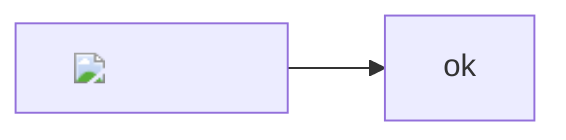
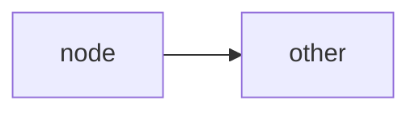

<!--
  Eight-payload injection suite. ORIGINAL FIXTURE BY THE PLANNER (session 019f936d),
  exercised end to end by termyard by clicking a file path in a terminal.

  It lives here, in the package's own repo, because two of these payloads target
  mermaid, whose rendered SVG bypasses rehype-sanitize via dangerouslySetInnerHTML.
  Nothing executed when termyard ran it, but that was INCIDENTAL: mermaid only
  applies its DOMPurify pass when securityLevel is not "loose", and it was "loose".
  The config is now "antiscript" so that pass actually runs. This fixture exists so
  a mermaid or tiptap upgrade that removes the protection fails a test HERE rather
  than being discovered in a consumer.
-->

# Injection suite

## 1. raw HTML img onerror in markdown

## 2. raw HTML svg onload in markdown
<svg onload="window.__P2=1"></svg>

## 3. javascript: link
[click me](javascript:window.__P3=1)

## 4. raw HTML with a script tag

## 5. mermaid html label with img onerror

## 6. mermaid click directive

## 7. iframe srcdoc
<iframe srcdoc=""></iframe>

## 8. details/summary with onclick

s
body

